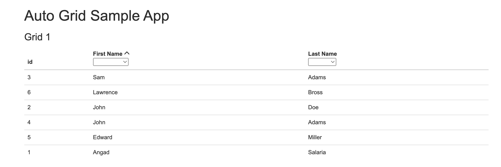
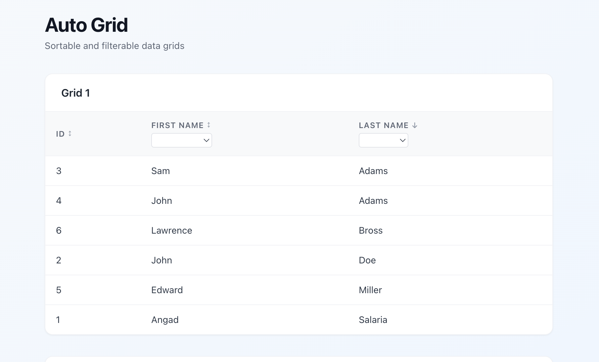

# as-auto-grid-react

A React + TypeScript rewrite of [as-auto-grid](https://github.com/angadsalaria/as-auto-grid), an Angular 2 data grid component built in 2016. This rewrite was developed entirely by [Claude](https://claude.ai) (Anthropic's AI) using Claude Code.

**Live demo:** https://angadsalaria.github.io/as-auto-grid-react/
**Original Angular app:** https://angadsalaria.github.io/as-auto-grid/

---

## Before / After

| Angular 2 (original) | React (rewrite) |
|---|---|
|  |  |

---

## What it does

Two independent sortable and filterable data grids, each with:

- **Per-column sorting** — click a column header to sort ascending, click again to sort descending, click a third time to return to unsorted. Clicking a different column always resets to ascending.
- **Per-column filtering** — a dropdown of unique values for each filterable column. Multiple filters combine with AND logic.
- **Filter reset** — a clear button appears next to the dropdown when a filter is active.
- **Filter-then-sort pipeline** — filtering is always applied before sorting.
- **Independent state** — Grid 1 and Grid 2 have completely separate sort and filter state.

---

## Enhancement over the original

During development, Claude identified an ambiguity in the original Angular app's sorting behaviour and proposed an improvement:

> The original `Sorting.update()` method toggled `isAscending` on every click regardless of which column was clicked, meaning the sort direction was shared global state. This produced two quirks: there was no way to return to an unsorted state, and clicking a new column would inherit the previous sort direction rather than starting fresh at ascending.

The React version implements a cleaner **three-state sort cycle**:

```
unsorted → ascending → descending → unsorted → …
```

Clicking a different column always resets to ascending, independent of where the previous sort left off. This behaviour was confirmed with the owner before implementation and is covered by dedicated tests.

---

## Stack

| | Original | Rewrite |
|---|---|---|
| Framework | Angular 2.0.0 | React 18 |
| Language | TypeScript (compiled via `tsc`) | TypeScript (via Vite) |
| Module loading | SystemJS | Vite (ESM) |
| Styling | Bootstrap 3 + glyphicons | Tailwind CSS |
| Data transforms | Lodash (Angular pipe) | Lodash (pure functions) |

---

## Architecture

```
src/
├── types/index.ts            # Shared Row, GridState, Sorting types
├── utils/gridTransform.ts    # Pure filter/sort functions (no React)
├── context/GridContext.tsx   # Per-grid state via React Context
├── components/
│   ├── AutoGrid.tsx          # Grid wrapper — provides context, renders tbody
│   └── ColumnHeader.tsx      # Sort arrow + filter dropdown header cell
└── App.tsx                   # Two grids with shared data, isolated state
```

The core data transform logic lives entirely in `gridTransform.ts` as pure functions, making it independently testable without any React machinery.

---

## Testing

Tests were written before implementation was verified in the browser, targeting functional parity with the original Angular app plus the three-state sort enhancement.

**Framework:** [Vitest](https://vitest.dev/) + [React Testing Library](https://testing-library.com/react)

### Test results — first run

```
✓ src/__tests__/gridTransform.test.ts   (21 tests)
✓ src/__tests__/AutoGrid.test.tsx       (19 tests)
✓ src/__tests__/App.test.tsx            ( 4 tests)

Tests  44 passed (44)
```

44/44 passed on the first run, with one trivial assertion corrected mid-run (expected `" "` vs actual `""` for the blank filter option's text content).

The three-state sort enhancement was added afterwards, bringing the suite to **45 tests (45 passed)**.

### Test structure

**`gridTransform.test.ts` — 22 tests (pure logic)**

Tests the filter/sort pipeline and sort-state machine in isolation, with no React involved:

- `getFilterOptions` returns unique, alphabetically sorted values per column
- Filter by single column, multiple columns (AND), empty string (no-op), no matches
- Sort ascending/descending by string and numeric columns
- Filter + sort combined (filter applied first)
- `updateSorting` state machine: `unsorted → asc → desc → unsorted` cycle; new column always starts at ascending

**`AutoGrid.test.tsx` — 20 tests (component behaviour)**

Renders the full `<AutoGrid>` + `<ColumnHeader>` tree and exercises it via user interactions:

- Initial render: all 6 rows, correct cell values
- Sort: 3-click cycle (asc → desc → unsorted), correct sort arrow icon per direction, icon only on active sort column, new column always starts ascending
- Filter: dropdown options match unique sorted data values, rows filtered correctly, reset button visibility (shown only when active), filter cleared on reset, multi-column AND filter, empty-state message when no rows match
- Combined: filter + sort applied in correct order

**`App.test.tsx` — 4 tests (grid independence)**

Confirms Grid 1 and Grid 2 are fully isolated:

- Both render all 6 rows initially
- Sorting Grid 1 does not reorder Grid 2
- Filtering Grid 1 does not affect Grid 2's row count
- Filtering Grid 2 does not affect Grid 1's row count

---

## Development

```bash
npm install
npm run dev       # start dev server
npm test          # run all tests
npm run build     # production build
```
